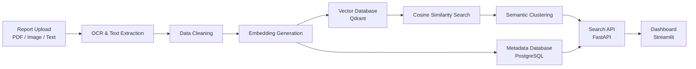

# VISTA — Full Technical Documentation

**Vector Intelligent Semantic Search Text Analysis**

This document is the complete technical reference for VISTA. Where the README gives a quick overview, this covers *every* layer of the system in depth — what it is, why it was chosen, and how it actually works under the hood.

---

## Table of Contents

1. [Project Overview](#1-project-overview)
2. [Problem Statement & Motivation](#2-problem-statement--motivation)
3. [Solution Approach](#3-solution-approach)
4. [End-to-End System Architecture](#4-end-to-end-system-architecture)
5. [Data Layer](#5-data-layer)
6. [NLP & Embedding Layer](#6-nlp--embedding-layer)
7. [Similarity & Clustering Engine](#7-similarity--clustering-engine)
8. [Backend API (FastAPI)](#8-backend-api-fastapi)
9. [Frontend Dashboard (Streamlit)](#9-frontend-dashboard-streamlit)
10. [Deployment & Infrastructure](#10-deployment--infrastructure)
11. [Security & Privacy](#11-security--privacy)
12. [Evaluation Methodology](#12-evaluation-methodology)
13. [Limitations & Known Trade-offs](#13-limitations--known-trade-offs)
14. [Future Scope](#14-future-scope)
15. [Glossary of Key Terms](#15-glossary-of-key-terms)

---

## 1. Project Overview

VISTA is a semantic data warehouse for medical text. Instead of storing and searching reports as flat files matched by exact keywords, VISTA converts every report into a numerical vector that encodes its *clinical meaning*, then organizes and retrieves reports by comparing those vectors. The practical effect: a query for "myocardial infarction" also surfaces reports that only say "heart attack," because the system compares meaning, not spelling.

The system is built from four cooperating layers:

| Layer | Responsibility |
|---|---|
| **Ingestion** | Get raw reports (text, PDF, scanned image) into the system |
| **Representation** | Turn each report into a dense vector (embedding) |
| **Storage & Retrieval** | Index vectors for fast similarity search; keep patient metadata separately |
| **Interface** | Expose search/clustering to clinicians via API and dashboard |

---

## 2. Problem Statement & Motivation

Hospitals produce a high volume of unstructured text: discharge summaries, radiology notes, lab reports, prescriptions, and progress notes, generated across dozens of departments. Two structural problems compound over time:

**Terminology drift across departments.** The same clinical event is documented differently depending on who wrote it — an ER physician might write "heart attack" where a cardiologist writes "myocardial infarction," and a pathology report might reference "MI" as shorthand. A keyword search system treats these as three unrelated strings.

**Volume growth outpaces manual organization.** Folder-based or tag-based filing systems work at small scale but degrade as report volume grows into the thousands or millions — new conditions, new abbreviations, and new specialties appear faster than any manual taxonomy can be updated.

The measurable consequences are duplicated documentation (the same case re-described because the earlier report wasn't found), delayed case review (clinicians spend time searching instead of reading), and rising administrative overhead as the data lake grows.

---

## 3. Solution Approach

VISTA's core idea is to replace **lexical matching** (comparing strings) with **semantic matching** (comparing meaning). This is done in three conceptual steps:

1. **Encode.** A pretrained language model reads each report and outputs a fixed-length vector — a point in high-dimensional space — such that clinically similar reports land near each other in that space, regardless of the exact words used.
2. **Compare.** Similarity between any two reports becomes a simple geometric calculation (cosine similarity) between their vectors, rather than a rule-based text match.
3. **Organize & serve.** Vectors are indexed for fast nearest-neighbor lookup, clustered so related reports group automatically, and exposed through a natural-language search API and dashboard.

This approach is a well-established NLP technique (dense retrieval / semantic search), not a novel algorithm — VISTA's contribution for this project is applying it specifically to a hospital-style, multi-department medical report pipeline, with metadata kept structurally separate from the semantic index for privacy reasons (see [Section 11](#11-security--privacy)).

---

## 4. End-to-End System Architecture

### 4.1 High-Level Pipeline



### 4.2 Component Breakdown

**Stage 1 — Report Upload.** Accepts three input classes: born-digital text, PDF documents, and scanned images (photos of printed reports). Each requires different handling downstream, which is why the pipeline branches at OCR.

**Stage 2 — OCR & Text Extraction.** Scanned images and image-based PDFs are not machine-readable text; an OCR engine (e.g. Tesseract or EasyOCR) converts pixel data into character strings, ideally preserving layout structure (which field a value belongs to) rather than dumping a flat blob of text. Born-digital PDFs/text skip OCR and go straight to cleaning.

**Stage 3 — Data Cleaning.** Raw extracted text is normalized: whitespace and line-break artifacts from OCR are removed, boilerplate headers/footers are stripped, and text is segmented into sentences. This step exists because embedding quality is sensitive to noisy input — an OCR artifact like a broken word can shift the resulting vector meaningfully.

**Stage 4 — Embedding Generation.** The cleaned text is passed through a sentence-transformer model, producing one fixed-length vector per report (see [Section 6](#6-nlp--embedding-layer) for full detail).

**Stage 5 — Dual Storage.** The vector goes to Qdrant (semantic index); the structured metadata (patient ID, department, report type, timestamp) goes to PostgreSQL. These are two separate systems on purpose — see [Section 11](#11-security--privacy).

**Stage 6 — Similarity Search.** At query time, the query text is embedded the same way, then compared against all stored vectors using cosine similarity to return the closest matches.

**Stage 7 — Clustering.** Independently of individual queries, the full vector set is periodically clustered so that structurally similar reports (e.g. all cardiology-related notes, regardless of who wrote them) are grouped for browsing, not just searching.

**Stage 8 — API Layer.** FastAPI exposes both search and cluster-browse operations to clients.

**Stage 9 — Dashboard.** Streamlit renders the API's output as an interactive interface for a non-technical clinical user.

---

## 5. Data Layer

### 5.1 Dataset — MTSamples

The project's base corpus is **MTSamples**, a publicly available collection of de-identified medical transcription samples spanning roughly 40 clinical specialties (Surgery, Cardiovascular/Pulmonary, Orthopedics, Radiology, Neurology, and others). Each record includes free-text transcription content plus a `medical_specialty` label, which is useful beyond just being training data — it doubles as a **ground-truth label** for evaluating whether VISTA's unsupervised clustering actually recovers clinically meaningful groups (see [Section 12](#12-evaluation-methodology)).

A known property of this dataset worth documenting explicitly: MTSamples contains a meaningful proportion of near-duplicate or templated reports (multiple specialty entries reuse similar boilerplate transcription structure), so a raw uniqueness count on the source data is lower than the row count suggests.

### 5.2 Data Augmentation Methodology

To evaluate the pipeline at larger scale than the ~2,300–5,000 unique base reports, the dataset was expanded to 50,000 rows using **rule-based text augmentation** rather than simple duplication. Each base report generates several paraphrased variants through:

- **Protected-token substitution** — numeric values, units, dosages, and dates are regex-shielded before any text is altered, so clinical values are never corrupted by the augmentation step.
- **Phrase-level synonym swaps** — non-diagnostic connector language ("shows" → "reveals," "history of" → "prior history of") is varied; negations and diagnostic terms are left untouched.
- **Constrained sentence reordering** — only interior sentences of longer reports are shuffled; the opening (chief complaint) and closing (plan/follow-up) sentences stay fixed so clinical narrative logic is preserved.

This is documented as **synthetic scale-testing data**, not as 50,000 organically distinct clinical cases — an important distinction to state plainly in any report or viva, since the underlying clinical content still traces back to a few thousand unique base reports.

### 5.3 Metadata Schema (PostgreSQL)

Structured fields are kept in a relational schema, separate from the vector index. A representative simplified schema:

```sql
CREATE TABLE reports (
    report_id       UUID PRIMARY KEY,
    patient_id      UUID NOT NULL,
    department      VARCHAR(100),
    report_type     VARCHAR(100),      -- e.g. 'Discharge Summary', 'Radiology'
    created_at      TIMESTAMP,
    vector_id       UUID,              -- foreign reference into Qdrant, not a join
    ocr_confidence  FLOAT,
    source_format   VARCHAR(20)        -- 'pdf' | 'image' | 'text'
);

CREATE TABLE patients (
    patient_id      UUID PRIMARY KEY,
    age             INT,
    gender          VARCHAR(10),
    admission_date  DATE
);
```

The `vector_id` column is a pointer, not a database join — PostgreSQL and Qdrant are intentionally two separate systems with no query-time coupling between structured PII and the semantic index.

### 5.4 Object Storage (MinIO)

Raw source files (the original PDF/image uploads) are archived in MinIO, an S3-compatible object store. This exists so the *original* document is always retrievable for audit or re-processing (e.g. if OCR quality improves later, or if a clinician wants to see the literal scanned page), without needing to keep large binary blobs inside the relational database.

---

## 6. NLP & Embedding Layer

### 6.1 What Is a Sentence Embedding

An embedding model maps a piece of text to a fixed-length list of numbers (a vector) such that texts with similar meaning produce vectors that are numerically close together. This is fundamentally different from older approaches like bag-of-words or TF-IDF, which represent text based on which words appear, not what they mean — two sentences with zero words in common can still get very similar embeddings if they express the same idea.

### 6.2 Model Used — `all-MiniLM-L6-v2`

`all-MiniLM-L6-v2` is a distilled transformer model from the Sentence-Transformers library — a compressed version of a larger BERT-style model, trained specifically so that its output vectors are directly comparable via cosine similarity (many raw transformer models are not trained for this and need extra fine-tuning to be useful for similarity search out of the box).

**Correction worth flagging:** the project stats table lists a 768-dimension embedding size, but `all-MiniLM-L6-v2` actually outputs **384-dimensional** vectors — this is a well-known, fixed property of that specific model (it's the "MiniLM," i.e. distilled, sibling of a larger 768-d model). Two ways to resolve the mismatch, whichever fits the project's compute budget:
- Keep `all-MiniLM-L6-v2` and correct the stats table to **384-D** (faster, smaller index, slightly lower semantic fidelity), or
- Switch to `all-mpnet-base-v2` (genuinely 768-D, higher quality, roughly 3-4x slower to encode and larger to store).

Whichever is chosen, the number in the documentation should match what the code actually loads — this is an easy thing for an evaluator to check.

**Why a distilled model at all:** smaller transformer models trade a small amount of embedding quality for substantially faster inference and lower memory use, which matters when embedding tens of thousands of reports and running low-latency search over them.

### 6.3 Tokenization & Preprocessing

Before reaching the embedding model, text passes through the model's own subword tokenizer (WordPiece-style), which splits words into smaller known sub-units so that rare or misspelled medical terms can still be represented rather than becoming "unknown" tokens outright. Upstream, the Stage 3 cleaning step (see [Section 4.2](#42-component-breakdown)) handles document-level noise (OCR artifacts, formatting) — the tokenizer handles word-level segmentation.

---

## 7. Similarity & Clustering Engine

### 7.1 Cosine Similarity

Given two vectors A and B, cosine similarity measures the cosine of the angle between them:

$$\cos(\theta) = \frac{A \cdot B}{\lVert A \rVert \lVert B \rVert}$$

The key property that makes this preferable to Euclidean distance for text: cosine similarity ignores vector *magnitude* and only measures *direction*. Embedding magnitude tends to correlate with factors like document length rather than meaning, so a long, verbose report and a short, terse report describing the same diagnosis can still score as highly similar under cosine similarity, whereas raw Euclidean distance would be skewed by the length difference.

| Score | Interpretation |
|:---:|---|
| 1.0 | Near-identical clinical meaning |
| 0.8+ | Highly related medical context |
| 0.5 | Moderately related context |
| 0.0 | Unrelated |
| -1.0 | Semantically opposite (rare in practice for this kind of text) |

### 7.2 Vector Indexing — Qdrant & HNSW

Comparing a query vector against every stored vector one-by-one (brute-force) becomes too slow once the index reaches tens of thousands of vectors. Qdrant solves this using **HNSW** (Hierarchical Navigable Small World graphs), an approximate-nearest-neighbor algorithm that organizes vectors into a multi-layer graph structure, allowing search to skip most of the index and only examine a small, relevant neighborhood of candidates. This trades a small amount of search accuracy (it's *approximate*, not exhaustive) for a large speed gain — the mechanism behind the "<2 second" search claim in the README.

Key tunable parameters in Qdrant/HNSW relevant to this project:

| Parameter | Effect |
|---|---|
| `m` | Number of graph connections per node — higher = better recall, more memory |
| `ef_construct` | Search depth used while building the index — higher = better quality index, slower to build |
| `ef_search` | Search depth used at query time — higher = better recall, slower query |

### 7.3 Clustering Approach

Independent of any single query, VISTA periodically groups the full vector set into clusters so reports can be *browsed* by theme, not just searched. Two complementary techniques fit this system:

- **K-means** — fast, requires specifying the number of clusters in advance; reasonable when the number of expected specialties/themes is roughly known (e.g. ~40, matching MTSamples specialties).
- **Hierarchical clustering** — builds a tree of nested clusters without needing to fix the cluster count upfront, which suits the "self-organizing" goal better when genuinely novel report themes might appear over time.

Cluster **quality** is validated using the **silhouette score** (how well-separated and internally cohesive clusters are, purely from the vectors) and, where ground truth exists, **cluster purity against the MTSamples `medical_specialty` label** — i.e., checking what fraction of a cluster actually shares the same real-world specialty label, which is the most concrete evaluation metric available for this project (see [Section 12](#12-evaluation-methodology)).

---

## 8. Backend API (FastAPI)

**Why FastAPI:** it's built on Python type hints and Pydantic, which gives automatic request/response validation and interactive API documentation (Swagger UI) for free — useful both for development speed and for demoing the API during evaluation. It's also natively asynchronous, which matters when a request involves waiting on an external call (embedding model inference, a database query) rather than pure CPU work.

Representative endpoint surface:

```python
from fastapi import FastAPI
from pydantic import BaseModel

app = FastAPI()

class SearchQuery(BaseModel):
    query_text: str
    top_k: int = 5

@app.post("/search")
async def semantic_search(payload: SearchQuery):
    """Embeds the query, searches Qdrant, joins results with PostgreSQL metadata."""
    ...

@app.get("/clusters/{cluster_id}")
async def get_cluster(cluster_id: str):
    """Returns all reports currently grouped under a given semantic cluster."""
    ...

@app.post("/ingest")
async def ingest_report(file: bytes, department: str):
    """Runs a new report through OCR -> cleaning -> embedding -> dual storage."""
    ...
```

---

## 9. Frontend Dashboard (Streamlit)

Streamlit was chosen for rapid UI development directly in Python, without a separate frontend build step — appropriate for a project-scale system where the priority is demonstrating functionality rather than shipping a production-grade UI. The dashboard's core screens:

- **Search view** — a natural-language query box, returning ranked results with similarity scores.
- **Cluster browser** — visualizes clusters (e.g. via a 2D projection of the high-dimensional vectors using t-SNE or UMAP for human-readable plotting) so a user can explore groupings without typing a query.
- **Report detail view** — shows the retrieved report's metadata (from PostgreSQL) alongside its content.

---

## 10. Deployment & Infrastructure

Docker containerizes each service (API, Qdrant, PostgreSQL, MinIO, dashboard) so the whole stack can be brought up consistently regardless of the host machine. A representative `docker-compose.yml` structure:

```yaml
version: "3.9"
services:
  qdrant:
    image: qdrant/qdrant
    ports: ["6333:6333"]
  postgres:
    image: postgres:16
    environment:
      POSTGRES_DB: medicaldb
    ports: ["5432:5432"]
  minio:
    image: minio/minio
    command: server /data
    ports: ["9000:9000"]
  api:
    build: ./backend
    depends_on: [qdrant, postgres, minio]
    ports: ["8000:8000"]
  dashboard:
    build: ./dashboard
    depends_on: [api]
    ports: ["8501:8501"]
```

This lets the whole system be started with a single `docker compose up`, which is worth having ready for a live demo.

---

## 11. Security & Privacy

The single most important design decision in VISTA is the **structural separation of PII from the semantic index**: patient-identifying fields (name, patient ID, admission details) live only in PostgreSQL; the vector store holds only the numerical embedding plus a non-identifying pointer back to the metadata row. This means that even if the vector database were exposed or compromised in isolation, it would not by itself reveal patient identity — reversing an embedding back into readable identifying text is not practically possible with current techniques.

Additional practices worth implementing/documenting:
- **De-identification at ingestion** — scrubbing names, dates of birth, and other direct identifiers from report text before embedding, not just from the metadata table.
- **Access control** — the API layer should authenticate and authorize requests (not shown in the minimal example above) before returning any metadata-joined result.
- **Audit logging** — who queried what, and when, given this is health data.

---

## 12. Evaluation Methodology

For a project like this, "it works" needs a number behind it. Concrete, low-effort evaluations available given the dataset:

1. **Clustering purity vs. ground truth.** Since MTSamples reports carry a `medical_specialty` label, compare VISTA's unsupervised clusters against that label — report what fraction of each cluster's members share the same true specialty.
2. **Silhouette score.** A label-free cohesion/separation metric computable directly from the embeddings, useful as a secondary check.
3. **Retrieval relevance (precision@k).** Hand-label a small set of query/report pairs as relevant or not (mentioned in earlier project discussion), then measure what fraction of the top-k search results are actually relevant.
4. **Latency benchmarking.** Measure actual query time end-to-end (embed + search + metadata join) at increasing index sizes (5K, 20K, 50K vectors) to produce a real number for the "<2 second" claim rather than an assumed one.

---

## 13. Limitations & Known Trade-offs

- **Approximate search.** HNSW trades a small amount of recall for speed — VISTA will occasionally miss a true nearest neighbor in exchange for fast queries.
- **Embedding model generality.** `all-MiniLM-L6-v2` (or any general-purpose sentence embedding model) is not specifically trained on clinical text; a domain-specific model (e.g. a BioBERT/ClinicalBERT-family model) would likely capture medical nuance more precisely, at the cost of a larger model and slower inference.
- **Synthetic scale data.** As noted in [Section 5.2](#52-data-augmentation-methodology), the 50,000-row expanded dataset demonstrates system behavior at scale but is not 50,000 independently authored clinical cases — this should be stated plainly rather than implied.
- **OCR error propagation.** Any OCR misread carries forward into the embedding and therefore into search/clustering quality; there's no downstream correction step in the current design.

---

## 14. Future Scope

- **RAG integration** — pairing the retrieval layer with a generative model to produce AI-assisted summaries of clustered historical cases.
- **Multimodal embeddings** — extending beyond text to include medical imaging (X-rays, scans) in the same vector space.
- **Federated search** — querying across multiple hospital systems' indexes without centralizing raw patient data in one place.
- **Domain-specific embeddings** — swapping the general-purpose sentence transformer for a clinical-text-tuned model.
- **Real clinical data** — a credentialed path to MIMIC-III/MIMIC-IV for validation against real (de-identified) ICU records, rather than MTSamples alone.

---

## 15. Glossary of Key Terms

| Term | Meaning |
|---|---|
| **Embedding** | A fixed-length numerical vector representing the meaning of a piece of text |
| **Cosine similarity** | A measure of the angle between two vectors, used to score how similar two embeddings are |
| **Vector database** | A database purpose-built to store and search embeddings efficiently (e.g. Qdrant) |
| **HNSW** | Hierarchical Navigable Small World graph — the approximate-nearest-neighbor algorithm behind fast vector search |
| **Sentence-Transformer** | A transformer model fine-tuned so its output vectors are directly comparable via similarity metrics |
| **OCR** | Optical Character Recognition — converting an image of text into machine-readable text |
| **PII** | Personally Identifiable Information — data that can identify a specific patient |
| **Silhouette score** | A metric measuring how well-separated and cohesive clusters are |
| **De-identification** | Removing or masking identifying details from a record |
