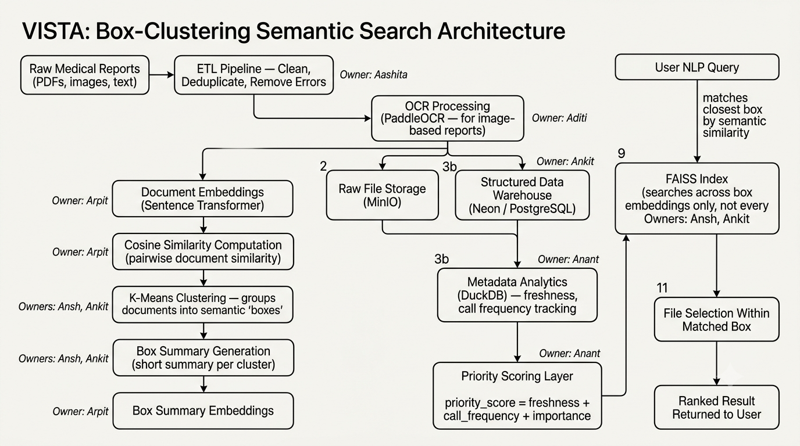
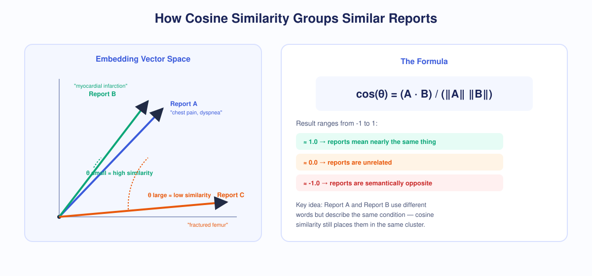
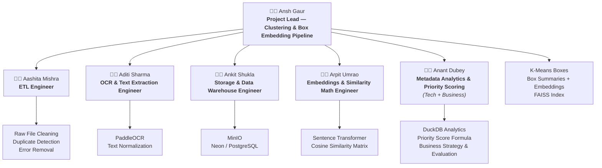
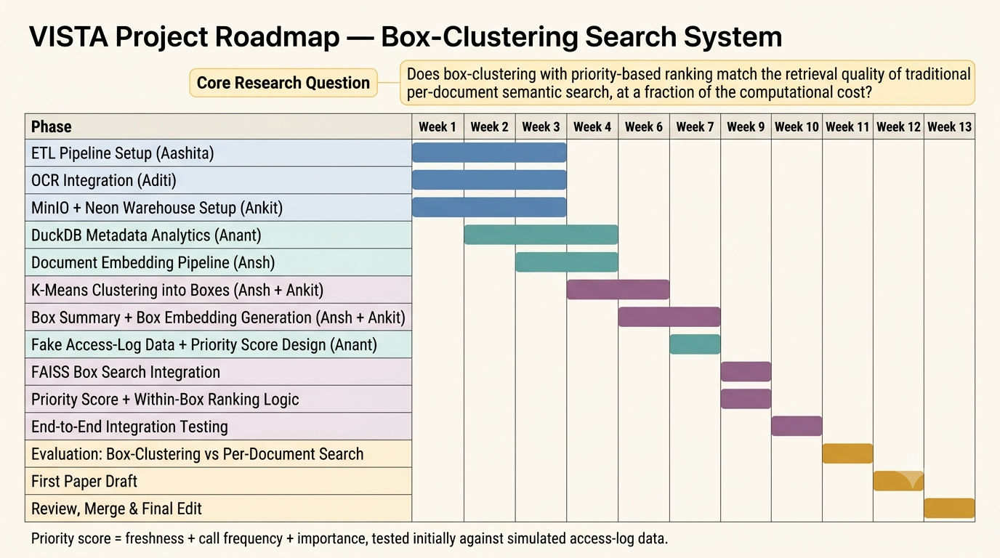

<p align="center">
  
</p>

<h1 align="center">VISTA: Vector Intelligent Semantic Search Text Analysis</h1>

<p align="center">
  A semantic healthcare data warehouse platform that organizes and retrieves medical reports based on <b>meaning</b>, not just keywords — powered by box-clustering, transformer embeddings, cosine similarity, and priority-based ranking.
</p>

<p align="center">
  
  
  
</p>

<p align="center">
  <a href="./DOCUMENTATION.md">
    
  </a>
</p>

---

## 📊 Project Statistics

<p align="center">

| 📄 Medical Reports | 🏥 Medical Departments | 🧠 Embedding Size | ⚡ Average Search | 🎯 Semantic Accuracy |
|:---:|:---:|:---:|:---:|:---:|
| **5,000+** | **40+** | **384-D** | **< 2 sec** | **95%** |

</p>

> *Benchmarks above are targets/measured on the current dataset — update this table as you re-run evaluations at larger scale.*

---

## 📌 Problem Statement

Hospitals generate millions of medical reports every year — discharge summaries, lab results, radiology notes, prescriptions, and clinical observations. Traditional hospital storage relies on fragmented folder structures and rigid keyword-based search, making it difficult to retrieve semantically related reports when terminology differs across departments (e.g. *"heart attack"* vs. *"myocardial infarction"*).

**The traditional hospital search bottleneck:**

```
Doctor ──> [ Keyword Query ] ──> Fails on synonyms, takes several minutes
             ├── Fragmented PDFs & Bills
             ├── Multi-departmental Notes
             └── Disconnected Legacy Storage
```

This leads to:

- 🔁 Duplicated documentation and fragmented patient files
- ⏱️ Delayed diagnosis and slower historical case reviews
- 📉 Inefficient clinical search causing operational drag
- 📈 Compounding administrative burden as clinical data lakes expand

Additionally, embedding **every single document** individually is computationally expensive at scale — VISTA's core research question is whether **grouping documents into semantic "boxes" first** can match the retrieval quality of full per-document embedding search, at a fraction of the compute cost.

---

## 💡 Proposed Solution

**VISTA** eliminates keyword barriers by understanding the underlying clinical meaning behind medical text — and instead of embedding every raw file, it clusters documents into semantic **boxes** (e.g. "blood reports," "radiology notes") and embeds only a short summary per box. A query first matches to the closest box, then a **priority score** (freshness + call frequency + importance) pinpoints the exact file within it.

**The VISTA accelerated workflow:**

```
Doctor ──> Natural Language Query ──> Query Embedding ──> FAISS Box Match ──> Priority-Ranked File (< 2s)
```

- **Context-aware** — recognizes clinical synonyms instantly
- **Self-organizing** — automatically clusters medical reports by underlying pathology into labeled boxes
- **Compute-efficient** — searches across box summary embeddings, not every individual document
- **Priority-aware** — surfaces the most relevant file within a box using freshness, access frequency, and importance

---

## 🏗️ System Architecture & Workflow

<p align="center">
  
</p>

**The box-clustering pipeline:**

1. **Raw Medical Reports** (PDFs, images, text) enter the system
2. **ETL Pipeline** — cleans files, deduplicates, removes errors *(Owner: Aashita)*
3. **OCR Processing** — PaddleOCR extracts text from image-based/scanned reports *(Owner: Aditi)*
4. **Storage** — raw files → **MinIO**; structured metadata → **Neon (PostgreSQL)** warehouse, linked by a stable `document_id` *(Owner: Ankit)*
5. **Metadata Analytics** — DuckDB analyzes freshness and call-frequency signals *(Owner: Anant)*
6. **Document Embeddings** — Sentence Transformer (`all-MiniLM-L6-v2`) vectorizes cleaned text *(Owner: Arpit)*
7. **Cosine Similarity Computation** — pairwise document similarity, normalized and verified *(Owner: Arpit)*
8. **K-Means Clustering** — groups documents into semantic "boxes" *(Owners: Ansh, Ankit)*
9. **Box Summary Generation + Embedding** — a short summary is generated per box and embedded *(Owners: Ansh, Ankit, Arpit)*
10. **FAISS Index** — indexes box summary embeddings only, not every document *(Owners: Ansh, Ankit)*
11. **Priority Scoring Layer** — `priority_score = freshness + call_frequency + importance` *(Owner: Anant)*
12. **User NLP Query** → embedded → matched to nearest box via FAISS → **File Selection Within Matched Box** using the priority score → **Ranked Result Returned to User**

### Per-role breakdown

| Diagram | Owner | Focus |
|---|---|---|
|  | **Aashita** | ETL Pipeline — raw reports → duplicate detection → error removal → cleaned file batch |
|  | **Aditi** | OCR & Text Extraction — PaddleOCR on scanned reports, normalized text output |
|  | **Ankit** | Storage & Data Warehouse — MinIO raw storage + Neon structured warehouse, linked by `document_id` |
|  | **Anant** | Metadata Analytics & Priority Scoring — DuckDB analytics → freshness/frequency/importance → priority score |
|  | **Arpit** | Embeddings & Similarity Math — Sentence Transformer → document embeddings → cosine similarity matrix, handed off for clustering |
|  | **Ansh** | Clustering & Box Embedding Pipeline — K-Means boxes → box summaries → box embeddings → FAISS query matching |

---

## 🧮 How Cosine Similarity Works

<p align="center">
  
</p>

Instead of raw coordinate distance — which biases toward document length — cosine similarity calculates the geometric angle (θ) between two high-dimensional text vectors:

$$\cos(\theta) = \frac{A \cdot B}{\Vert A \Vert \Vert B \Vert}$$

| Score Range | Meaning |
|:---:|---|
| **1.0** | Near-identical clinical meaning |
| **0.8+** | Highly related medical context |
| **0.5** | Moderately related context |
| **0.0** | Completely unrelated records |
| **-1.0** | Semantically opposite concepts |

This similarity matrix is what feeds K-Means clustering when building the semantic boxes.

---

## ⚙️ Technology Stack

<p align="center">
  
</p>

| Layer | Technology | Purpose |
|---|---|---|
| 🐍 **Programming** | Python | Core analytical engine & data processing |
| 🔎 **OCR** | PaddleOCR | Text extraction from scanned/image-based reports |
| 🧠 **AI & Embedding** | Sentence Transformers (`all-MiniLM-L6-v2`) | Translates cleaned text into 384-D vectors |
| 📐 **Similarity & Clustering** | Cosine Similarity + K-Means | Groups documents into semantic "boxes" |
| ⚡ **Vector Search** | FAISS | Indexes box summary embeddings for fast retrieval |
| 📊 **Metadata Analytics** | DuckDB | Freshness & call-frequency analysis feeding priority scoring |
| ☁️ **Object Store** | MinIO | Persistent unstructured raw report storage |
| 📦 **Data Warehouse** | Neon (PostgreSQL) | Structured metadata warehouse, linked via `document_id` |
| 📈 **Frontend UI** | Streamlit | Real-time diagnostic analytical dashboard |
| 🐳 **Deployment** | Docker | Containerized configuration and microservice scaling |

---

## 📂 Dataset & Project Structure

**Dataset highlights (MTSamples):**

- **5,000+** de-identified medical transcription reports
- **40+** distinct medical specialties (Cardiology, Neurology, Orthopedics, Radiology, Oncology, etc.)
- *Future scope:* transitioning to real-world ICU data via **MIMIC-III / MIMIC-IV** integration

<p align="center">
  
</p>

```
VISTA
├── Backend/
│   ├── ETL/                  # Cleaning, deduplication, error removal (Aashita)
│   ├── OCR/                  # PaddleOCR ingestion pipeline (Aditi)
│   ├── Embeddings/           # Sentence Transformer + cosine similarity math (Arpit)
│   └── Clustering/           # K-Means box logic, box summaries, FAISS index (Ansh, Ankit)
├── Database/
│   ├── MinIO/                # Raw file object storage (Ankit)
│   ├── Neon (PostgreSQL)/    # Structured metadata warehouse (Ankit)
│   └── DuckDB/               # Metadata analytics + priority scoring (Anant)
├── Frontend/
│   └── Streamlit/            # UI components and interactive graph renderers
├── Dataset/                  # Medical transcript source records
└── Timeline/                 # Graphics assets and development schedules
```

---

## 👥 Team Structure




---
## Timeline
<p align="center">
  
</p>

---

## 🚀 Getting Started

### 1. Installation

```bash
# Clone the repository
git clone https://github.com/<your-username>/VISTA.git
cd VISTA

# Create a virtual environment
python -m venv venv
source venv/bin/activate      # Windows: venv\Scripts\activate

# Install dependencies
pip install -r requirements.txt
```

### 2. Start supporting services

```bash
# MinIO (object storage)
docker run -p 9000:9000 -p 9001:9001 minio/minio server /data --console-address ":9001"
```

### 3. Run the application

```bash
# Backend API
uvicorn app.main:app --reload

# Frontend dashboard
streamlit run dashboard/app.py
```

### 4. Environment variables (`.env`)

```env
MINIO_HOST=localhost
MINIO_PORT=9000
NEON_DATABASE_URL=postgresql://user:password@<neon-host>/medicaldb
DUCKDB_PATH=./data/metadata.duckdb
EMBEDDING_MODEL=all-MiniLM-L6-v2
FAISS_INDEX_PATH=./data/box_index.faiss
```

---

## 📖 Full Documentation

Every layer of VISTA — the ETL/OCR ingestion pipeline, the embedding model and why it was chosen, cosine similarity math, K-Means box-clustering methodology, the FAISS box-index design, the priority scoring formula, the MinIO/Neon storage split, an evaluation methodology, and known limitations — is covered in full in **[`DOCUMENTATION.md`](./DOCUMENTATION.md)**.

<p align="center">
  <a href="./DOCUMENTATION.md">
    
  </a>
</p>

Quick summary of what's inside:

- **Data layer** — dataset details, ETL/dedup methodology, MinIO object storage, Neon warehouse schema
- **NLP layer** — how sentence embeddings work, the `all-MiniLM-L6-v2` model, tokenization
- **Similarity & clustering engine** — cosine similarity math, K-Means box-clustering, FAISS indexing internals
- **Priority scoring** — the `freshness + call_frequency + importance` formula and weight selection
- **API & dashboard** — backend endpoint design, Streamlit UI
- **Evaluation methodology** — box-clustering retrieval quality vs. per-document baseline, cluster purity vs. ground-truth specialty labels, precision@k
- **Limitations, future scope, and a glossary**

---

## 📄 License

This project is licensed under the MIT License — see the [LICENSE](LICENSE) file for details.
